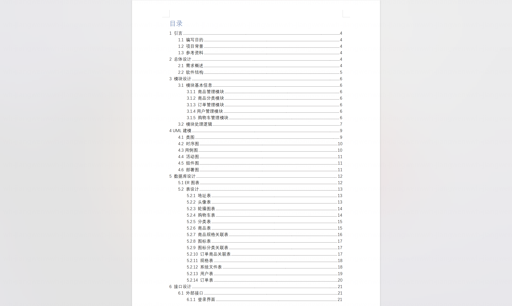
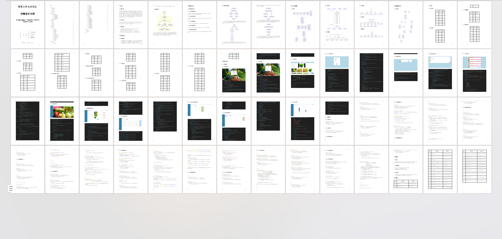
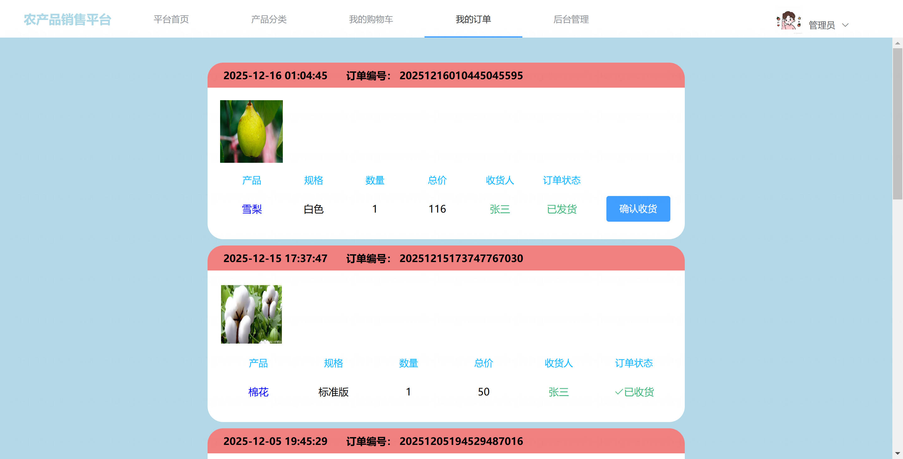
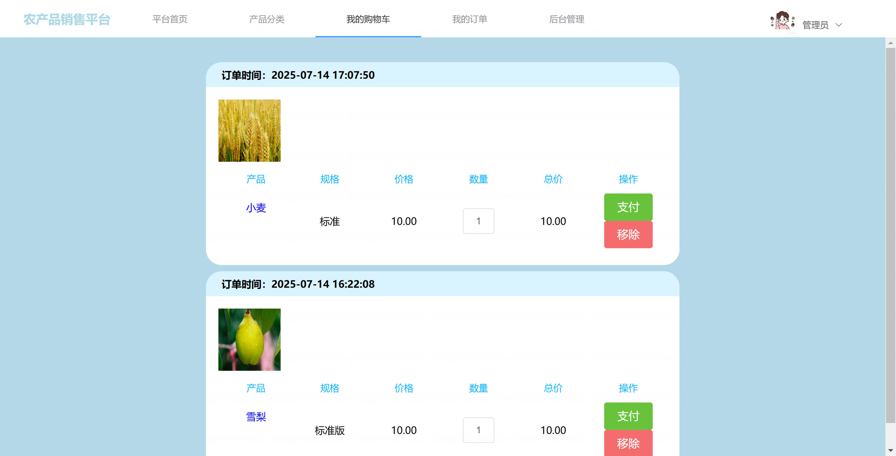
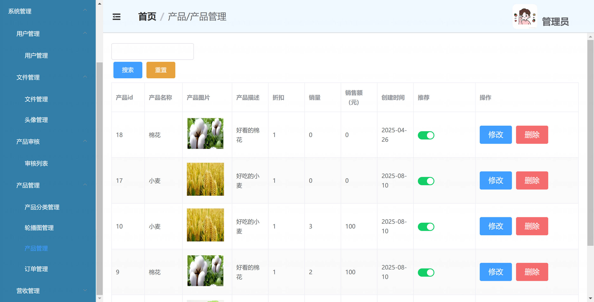
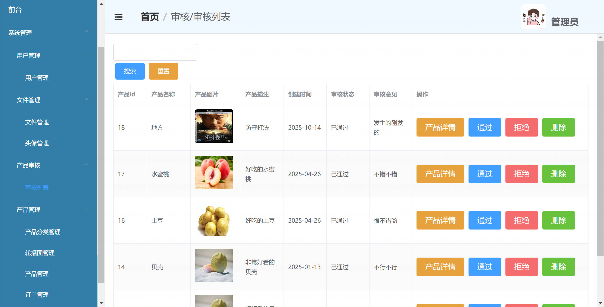
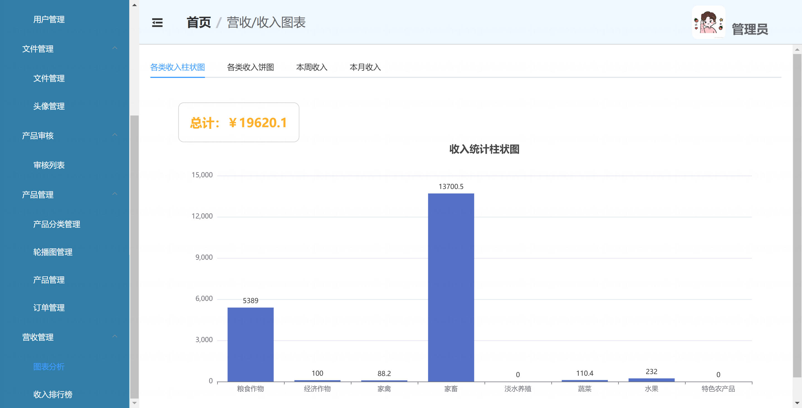
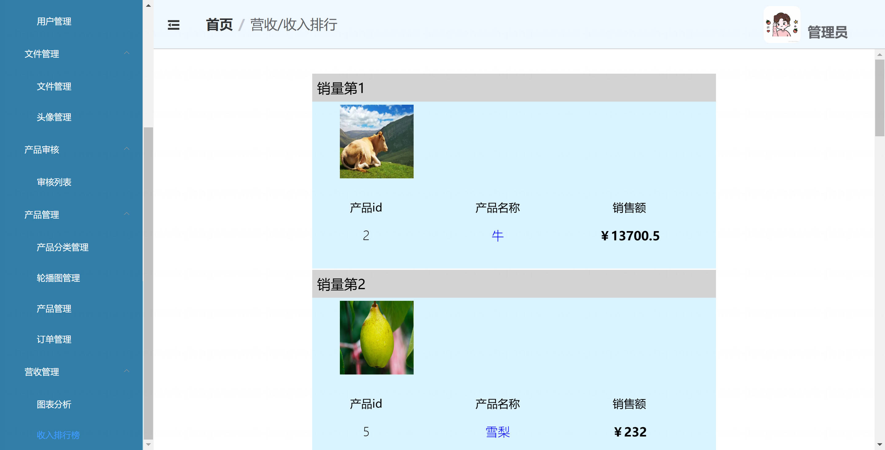
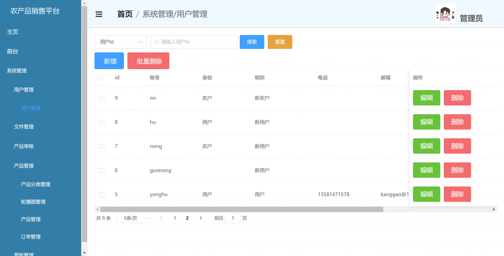

<h1 align="center">基于SpringBoot+Vue的农产品销售管理系统【带论文】</h1>

- <b>完整代码获取地址：从戎源码网 ([https://armycodes.com/](https://armycodes.com/))</b>
- <b>技术探讨、资料分享，请加QQ群：692619798</b>
- <b>作者微信：19941326836  QQ：3645296857</b>
- <b>承接计算机毕业设计、Java毕业设计、Python毕业设计、深度学习、机器学习</b>
- <b>选题+开题报告+任务书+程序定制+安装调试+论文+答辩ppt 一条龙服务</b>
- <b>所有选题地址 ([https://github.com/Descartes007/allProject](https://github.com/Descartes007/allProject)) </b>

## 一、项目介绍

基于SpringBoot的农产品销售平台，系统角色为 管理员（admin）、农户（farmer） 和 普通用户（user），主要功能如下：
### 普通用户（user）
- 账号：注册、登录、查看/修改个人信息、查看头像
- 商品浏览：首页轮播、商品列表、按分类筛选、商品详情（含规格）
- 购物流程：加入购物车、编辑/删除购物车项、确认订单、模拟支付、查看订单、确认收货
- 文件与头像：显示头像、下载/查看已上传文件（只读）
### 农户（farmer）
- 包含普通用户的全部功能
- 商品管理：新增/编辑/删除商品、上传商品图片、管理商品规格、提交待审核商品
- 查看自己的销售/订单情况（可用于对接营收统计）
### 管理员（admin）
- 包含农户/普通用户的相关查看权限
- 用户管理：分页查询用户、新增/编辑/删除用户、批量删除、重置密码
- 商品与分类管理：商品 CRUD、分类 CRUD、轮播图管理
- 文件管理：文件上传（/file/upload）、分页查询、删除、启用/禁用
- 订单管理：分页查看订单、按订单号查询、发货、确认收货
- 审核管理：商品审核列表与详情（审核通过/拒绝）
- 统计报表：营收图表、收入排行

## 二、项目技术

- 编程语言：Java（后端）、JavaScript/Vue（前端）
- 项目架构：B/S 架构（前后端分离）
- 前端技术栈：Vue 2、Vue Router、Vuex，Element UI，axios
- 后端技术栈：Spring Boot，MyBatis-Plus / MySQL，Redis，JWT

## 三、运行环境

- JDK版本：1.8及以上都可以
- 操作系统：Windows7/10、MacOS
- 开发工具：IDEA、Ecplise、MyEclipse都可以
- 数据库: MySQL5.5/5.7/8.0版本都可以
- npm版本：6.14.13及以上都可以
- Redis版本：3.2.100及以上都可以

## 四、数据库配置文件

- 文件名：application.yml和application-dev.yml
- 编码类型：utf8

## 论文截图

## 系统截图

